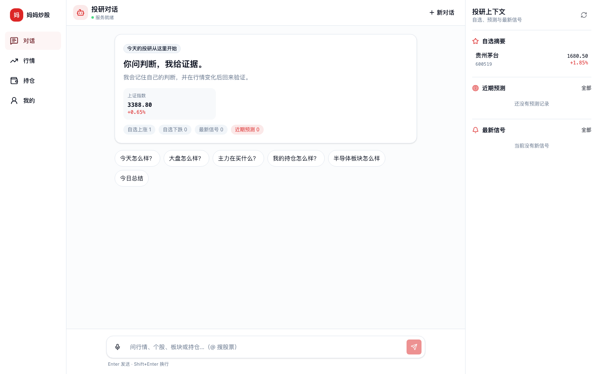
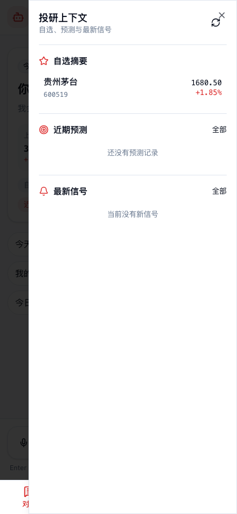
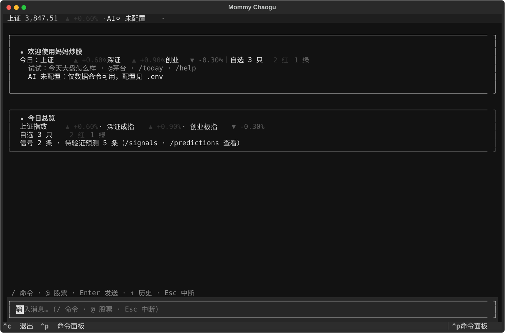

# mommy-chaogu

<div align="center">

[](LICENSE)
[](https://www.python.org/downloads/)
[](https://github.com/coffee-man666/mommy-chaogu/actions/workflows/ci.yml)
[](CHANGELOG.md)
[](#项目数据)
[](https://github.com/astral-sh/ruff)
[](docs/TECH-DEBT.md)

</div>

A 股投研工具集 — 行情监控、资金流分析、AI agent 对话、自进化记忆系统、回测引擎。

从一个「给妈妈用的手机行情工具」起步，逐步演进为涵盖数据采集、信号告警、LLM 分析、预测验证闭环、回测评估的完整投研框架。当前版本 **v1.2.0**，变更记录见 [CHANGELOG](CHANGELOG.md)。

---

## 界面一览

**Web 对话首页（桌面）**



**Web 投研上下文（移动端）**



**终端 TUI 单屏对话**



---

## 核心能力

| 能力 | 说明 |
|---|---|
| **自然语言入口** | `mommy` 命令：用自然语言描述需求，自动匹配 9 个预定义工作流，未命中 fallback 到 LLM agent |
| **统一首次配置** | 首次运行 `mommy` 自动引导选择 Provider / 模型、隐藏输入并验证 Key，可继续微信扫码；用户级配置换目录仍生效 |
| **工具调用可视化** | `--verbose` 显示完整路由决策 + 工具调用过程（`🔧 调用: get_quote...`），消除 AI 黑盒感 |
| **行情数据** | 多源 fallback（东财 + 腾讯 + 缓存），报价 / K 线 / 资金流 / 板块排行 / 基本面 |
| **资金流分析** | 主力净流入比率 (bp) 信号、板块扫描、收盘日报、历史回测 |
| **AI Agent** | 25 个 function-calling 工具，支持 deepseek / openai / kimi / z.ai (GLM) / Nova Bridge / MiniMax，Web 聊天 + 流式推送 |
| **自进化记忆** | 5 层记忆架构（工作/情景/预测验证/语义知识/向量检索），`mommy memory` 命令查看记忆 |
| **回测引擎** | 规则回测 + LLM 回测 + 组合分析 + walk-forward 过拟合检测 + 市场环境分组分析 |
| **财报窗口** | 业绩前瞻入库 + actual vs predicted 自动打分，4 种 verdict 分级 |
| **信号告警** | 7 条内置规则 + 自定义价格/涨跌幅告警，可在 Web 信号页和 TUI `/signals` 查看 |
| **Web UI** | 移动优先的对话首页 + 投研上下文栏，支持名称搜股、对话排队、语音输入、预测/信号闭环与 WebSocket 流式推送 |
| **终端 TUI** | `mommy tui`：Claude Code 风格单屏投研对话，富卡片、`@` 股票联想、slash 命令、忙时排队与 Esc 中断 |
| **安全边界** | 单用户 Bearer 令牌 + WebSocket 短期签名 ticket + 受限 CORS；Web 服务默认仅监听 127.0.0.1 |
| **Docker 部署** | `docker compose up -d` 一键启动，可复现构建 + 非 root 运行 |

---

## 5 分钟快速上手

```bash
# 1. 克隆
git clone https://github.com/coffee-man666/mommy-chaogu.git
cd mommy-chaogu

# 2. 一次配置 AI + 微信（也可直接运行 mommy 自动进入）
uv run mommy setup

# 3a. Docker 一键启动 Web 服务（推荐，无需安装 Python / Node / uv）
docker compose up -d
# 打开 http://localhost:8000

# 3b. 或者用 CLI 直接查询（uv 会自动处理依赖）
uv run mommy "今天大盘怎么样"
```

> 🔧 无 API key？行情查询、资金流等工作流仍可正常使用，AI 分析功能需要配置 key。
> 部署到 Railway 需额外配置公网令牌和持久化卷，见 [Railway 部署指南](docs/RAILWAY-DEPLOYMENT.md)。

<details>
<summary>本地开发安装（uv）</summary>

```bash
# 需要 Python 3.12+
uv sync --frozen --extra dev

# 配置 Provider、模型、Key 和可选微信连接
uv run mommy setup

# 跑质量门确认环境正常
./scripts/quality.sh
```

</details>

---

## 使用示例

**1. 自然语言查询（推荐）**

```bash
uv run mommy          # 进入交互式 REPL
uv run mommy "今天大盘怎么样"
uv run mommy "分析一下比亚迪"
uv run mommy "半导体板块怎么样"
uv run mommy -v "分析 600519"   # --verbose 显示工具调用过程
```

`mommy` 入口会自动匹配 9 个预定义工作流（零延迟快速路径），未命中则 fallback 到 LLM agent 对话。匹配时会显示 `[匹配: 大盘指数 + 板块行情]`，让用户了解路由决策。

**2. 结构化子命令**

```bash
uv run mommy watchlist add 600519 --group 白酒
uv run mommy watchlist list
uv run mommy memory stats          # 查看记忆系统统计
uv run mommy memory events         # 查看近期事件
uv run mommy agent "中芯国际资金流怎么样？"
uv run mommy web --port 8765       # 启动 Web UI
uv run mommy tui                   # 终端 UI（单屏对话 + 内联数据卡片）
```

> 旧的独立命令（`mommy-watchlist`、`mommy-monitor` 等）仍向后兼容。

**3. Web UI（手机访问）**

```bash
uv run mommy web --port 8765
```

移动端底部 4 Tab（对话/行情/持仓/我的）；桌面端对话页常驻自选、预测和信号上下文。对话支持多行输入、忙时排队、语音输入、断线解锁与失败重试。

Web 服务默认只监听 `127.0.0.1`。需要在局域网或公网访问时，必须配置业主令牌：

```bash
export MOMMY_API_TOKEN="$(openssl rand -hex 32)"
uv run mommy web --host 0.0.0.0 --port 8765
```

浏览器打开「我的 → 访问令牌」后输入同一令牌。令牌仅保存在当前浏览器会话；WebSocket 使用短期签名 ticket，不会把长期令牌放在 URL 中。

本机启动默认免登录，即使 `.env` 中保留了公网部署使用的 `MOMMY_API_TOKEN` 也不会要求
浏览器再次输入；确需在本机测试令牌认证时使用 `mommy-web --require-auth`。

### 微信远程对话（Beta）

无需开放公网端口即可把本地助手连接到微信：

```bash
uv run mommy channel weixin connect
```

终端会显示二维码。扫码确认后，授权只保存在本机，且默认只接受扫码账号的私聊。
完整安全边界和分步命令见 [微信本地频道](docs/WEIXIN-CHANNEL.md)。

**4. 终端 TUI（单屏对话）**

```bash
uv run mommy tui
```

行情、自选、持仓、资金流、预测和信号都以内联卡片进入同一条对话流；支持 Claude Code 风格 slash 命令、`@` 股票联想、忙时排队与 Esc 中断。

> 📖 更多功能：[场景化使用指南](docs/USER-GUIDE.md) | [CLI 速查](docs/DETAILED-ARCHITECTURE.md#cli-速查) | [记忆系统](docs/DETAILED-ARCHITECTURE.md#自进化记忆系统) | [回测引擎](docs/DETAILED-ARCHITECTURE.md#回测引擎)

---

## 架构

```
  用户输入（自然语言）
       |
       v
  ┌──────────┐
  │  mommy   │  自然语言入口（--setup 首次配置 / --verbose 工具可视化）
  └────┬─────┘
       |
  ┌────v──────┐     未命中 ──→ AgentService (LLM 自主选工具 + on_tool_call 回调)
  │ NLRouter  │     命中 ──→ WorkflowExecutor (预编排多步)
  └────┬──────┘              |
       |                     |  [匹配: 工作流名称] / [转交 AI 助手]
       v                     v
  ┌─────────────────────────────┐
  │      ToolRegistry (25 tools) │
  └────────────┬────────────────┘
               |
  ┌────────────v────────────┐
  │  Cache / Data Sources   │  ← last_source 标注（实时 / 本地缓存）
  │  (efinance / tencent)   │
  └─────────────────────────┘

  Web UI (Vite + Vue 3)   TUI (Textual)    CLI (mommy memory)
      |                       |                 |
      | HTTP / WebSocket      | 内部 adapter    | SQLite 查询
      v                       v                 v
  FastAPI (uvicorn)    data_service      agent_memory / episodic_events
   /     |      \                          predictions / semantic_knowledge
  /      |       \
Cache   Agent    Data Sources
(SQLite) Service  (efinance / tencent)
          |
   MemoryPipeline ---- EpisodicMemory
          |          -- PredictionTracker
          |          -- SemanticMemory
          |          -- VectorSearch
```

> 架构设计详解、数据库布局、设计原则见 [详细架构](docs/DETAILED-ARCHITECTURE.md)。

---

## 项目数据

| 指标 | 值 |
|---|---|
| 代码量 | ~51,000 行（src ~27,000 + tests ~16,000 + web ~7,000） |
| 测试 | 1,558 collected；1,545 个确定性离线测试 + 13 个定时网络探针 |
| CLI 入口 | `mommy` 统一入口 + 12 个透传子命令（watchlist / monitor / cache / semicon / flows / report / agent / memory / web / tui / channel / setup），另有 `mommy-earnings`、`mommy-mcp` 独立入口 |
| Agent 工具 | 25 个 function-calling tools |
| 数据库 | 4 个（market / portfolio / agent / reference） |
| LLM Provider | 6 个（deepseek / openai / kimi / z.ai / Nova Bridge / MiniMax） |
| 记忆系统 | 5 层（工作/情景/预测/语义/向量） |

---

## 文档

完整索引见 [docs/README.md](docs/README.md)。版本变更记录见 [CHANGELOG.md](CHANGELOG.md)。
技术债与质量门真实覆盖范围见 [docs/TECH-DEBT.md](docs/TECH-DEBT.md)。

---

## License

[MIT](LICENSE)

---

**免责声明**：本项目仅供学习和个人投资参考，不构成任何投资建议。A 股投资有风险，入市需谨慎。
